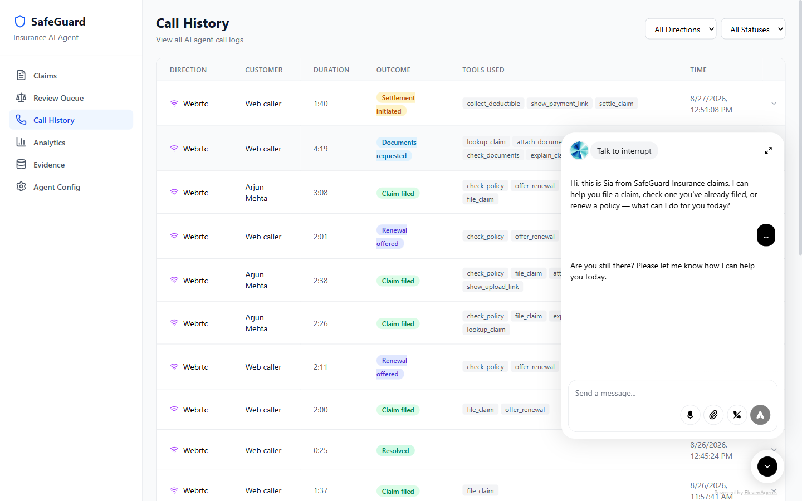

# SafeGuard

**An AI voice agent for insurance claims, where a person still makes every decision.**

A policyholder speaks to it in a browser. It looks up claims, explains coverage,
names the documents still outstanding, files new claims, takes payment for a
lapsed premium or an excess, and escalates to a human. Behind it, a dashboard
where an adjuster reads the reasoning behind a recommendation and approves or
rejects before any claim moves or any money leaves.

| | |
| --- | --- |
| **Dashboard** | https://safeguard-dashboard-cyan.vercel.app |
| **API health** | https://safeguard-api-production-7c24.up.railway.app/health |

Click **Start a call** in the bottom-right of the dashboard to talk to the agent
in your browser.



Razorpay AI Buildathon 2026, Open Track.

---

## The problem

My family held a health policy for close to ten years. A family member needed
emergency surgery. It then took **four months to file the claim** — not to settle
it, to file it.

Four months of repeated calls, each one starting over: the policy number again,
what happened again, which documents were needed — a different answer each time,
because the answer lived in whoever picked up. Nothing carried between calls.
What eventually came back was on the order of five or six percent of the bill,
and the remainder is still "under review" with no date attached.

Two grievances sit in that story and **only one of them is a software problem**:

- **The five percent is underwriting.** Policy terms, sub-limits, copays,
  exclusions. Nothing downstream of that decision changes it, and this project
  does not claim to.
- **The four months of repetition is not.** Every one of those calls existed
  because the previous call left no trace a system could read.

**The repetition is what SafeGuard removes.** One interaction files the claim,
names the documents that claim actually requires, takes the upload and collects
the excess — and every step after that is a timestamped row a claimant can be
shown, instead of the word "processing" repeated by a different person each time.

The full problem statement, the sourced numbers behind it, and the boundary
between what this fixes and what it cannot, are in
**[PRODUCT_PRD.md](PRODUCT_PRD.md) §2**.

---

## What it does, and what it refuses to do

The design property worth judging it on: **the model holds no claim facts.**
Every figure it speaks came back from a tool call against Postgres in the same
turn. It cannot invent a claim number because it never holds one.

- **Nine deterministic checks run before any model call**, and any one of them
  can veto. Policy in force on the incident date, claim type within cover, amount
  inside the limit, no near-duplicate, something left after the excess. Pure
  arithmetic — no network, no model.
- **The money tools take no amount parameter.** `settle_claim`,
  `collect_deductible` and `offer_renewal` take a reference number. The model has
  no slot in which to name a figure.
- **The model recommends; it never decides.** It cannot approve anything. A named
  human answers every recommendation before a claim moves.
- **Everything that fails escalates.** A parse failure, an API error, a
  recommendation that could not be recorded — each becomes an escalation, never
  an approval.
- **Where the model's arithmetic disagrees with the code's**, the claim escalates
  with both figures named, rather than the lower one being paid quietly.

How each of these is enforced, and where: **[ARCHITECTURE.md](ARCHITECTURE.md)**
§13 (adjudication), §12 (settlement), §20 (security), §23 (design principles).

**What it does not do.** It does not set payouts, does not model the copays and
sub-limits that produce a settlement figure, does not adjudicate medical
necessity, and does not remove the human decision. Claim settlement payouts are
**simulated** — they need RazorpayX and business KYC this account does not have,
and `/health` says so. Filecoin archival is wired but **has never succeeded**;
the on-chain attestation on Base Sepolia is real. Both are disclosed wherever
they appear.

---

## Run the whole journey yourself

**You will play two people.** There is one interface, not two, and that is
deliberate: separate portals would have meant a login, a role switch and two sets
of screens to explain, none of which is the product. The switch below is a change
of hat, not a change of software.

- **As the policyholder**, you speak to the voice agent — file the claim, send
  documents, pay the excess, ask what happened.
- **As the insurer's adjuster**, you open the Review Queue and decide the claim.

Two policies are held back carrying no claims at all, so a journey started on
either begins from nothing:

| Policy | Type | Excess | Claim this much |
| --- | --- | ---: | --- |
| `POL-2026-300010` | home | ₹5,000 | ₹15,000 – ₹40,000 |
| `POL-2026-300011` | home | ₹5,000 | ₹15,000 – ₹40,000 |

---

#### 1 · As the policyholder — file the claim

Open the dashboard, click **Start a call**, and say:

> "I need to file a claim on policy P-O-L, twenty twenty-six, three zero zero
> zero one zero. A pipe burst in the kitchen and damaged the flooring and the
> lower cabinets. The repair quote is about thirty thousand rupees."

It reads back a claim number. Nine deterministic checks have already run and the
claim has already been adjudicated — **do not ask it to adjudicate again**,
filing did that.

#### 2 · Still the policyholder — send the documents

It names what this claim requires and an upload card appears in the call widget.
Drop PDFs in.

The recommendation will read **escalate**. Adjudication runs the moment the claim
is filed, before any document exists, so the model is saying it cannot verify
what it has not seen. That is the design.

---

#### 3 · Now you are the insurer — decide it

Leave the call. Open **Review Queue**.

This is the only screen in the product that can approve anything. Read what the
machine actually produced: the nine checks with their reasons in English, the
model's recommendation and its stated doubts, the documents, and the payable
figure computed in code rather than proposed by the model.

Then decide, and **set *Who was at fault* to "The other party"**.

That fault finding is the step everything downstream depends on. It is a finding
of fact, no model may write it, and without it the refund refuses at its own
gate later — correctly, and by design.

*(Reject instead, and the claim shows as denied on the claim page with the reason
recorded. Worth doing once on a second claim to see it.)*

---

#### 4 · Back to the policyholder — pay the excess

Return to the call and ask where the claim has got to:

> "What's happening with my claim? Is there anything I need to pay?"

It offers a real Razorpay link for the ₹5,000 excess. Pay it with a test card and
**untick "Save this card"** — leaving it ticked diverts into an OTP flow that
never completes the payment.

#### 5 · Ask it to settle — and the refund happens on its own

> "Can you settle the claim now?"

The claim moves to **paid**, and the excess refunds automatically in the same
step.

**You cannot ask for the refund, and that is the point.** `refund_deductible` is
deliberately not one of the agent's tools: *"a voice tool that refunds on request
is a voice tool that refunds to whoever asks convincingly."* The refund happens
because an adjuster recorded fault in step 3 — not because a caller asked for it.

Open the claim page and the receipt is there: a real `rfnd_` id, Razorpay's own
current status, and a link to verify it against their API.

---

**What is real and what is not.** The excess going out and coming back is real
money on Razorpay's ledger. The settlement payout itself is **simulated** — it
needs RazorpayX and business KYC this account does not have — and every screen
says so rather than letting the refund imply the claim amount was paid.

Compare what you get against
[the run recorded here](backend/eval/journey/RESULTS.md): ten claims, ten of ten
stages, ₹29,000 returned.

> **Two limits worth knowing before you start.** Razorpay caps test mode at
> **30 payment links per business for the life of the account** — not a daily
> quota, and it does not reset. Enough remain for several journeys; if you see
> `link_failed` at the excess step, that is the cap rather than a bug, and every
> stage before it still runs ([FAILURE.md](FAILURE.md) §7). Second: refunds are
> paid from the merchant balance, not from the original payment, so a refund can
> be refused with a misleading *"invalid request sent"* when the balance is short
> (§8).


That is the happy path, and it is the one worth running first.

The refusal paths — a lapsed policy renewed before it will accept a claim, a
cancelled one that never will, and the eight gates a claim can be refused at —
are in **[TESTING.md](TESTING.md)**, along with the scripts for each.

## Running it yourself

```bash
# Database — run backend/database/RUN-IN-SUPABASE.sql in the Supabase SQL editor.
# It is idempotent and creates every table plus the seeded book of business.

cd backend
npm install
cp .env.example .env        # fill in Supabase, ElevenLabs, Groq, Razorpay
npm run dev

cd ../frontend
npm install
cp .env.example .env        # VITE_API_URL, VITE_SUPABASE_URL, agent id
npm run dev
```

```bash
cd backend
npm test                    # the backend suite, src/**/*.test.ts
npx tsc --noEmit            # typecheck
npm run check:setup         # schema, dataset, evidence integrity
npm run check:numbers       # every number in these docs against its source
npm run evaluate            # the deployed agent against the evaluation cases
npm run ablate              # what each safety layer contributes
```

`npm run check:numbers` is the one worth knowing about: it reads the live
database, the test runner and the committed evaluation artifacts, then checks
every numeric claim in this repository's documentation against them. If a figure
here disagrees with its source, that command fails and names the file and line.

Environment variables, deployment targets and how each piece ships:
**[DEPLOYMENT.md](DEPLOYMENT.md)**.

---

## Where everything else is

Each document does one job, so a claim lives in exactly one place and cannot
drift from itself.

| Document | What it is for |
| --- | --- |
| **[PRODUCT_PRD.md](PRODUCT_PRD.md)** | The problem, who it is for, what is in and out of scope |
| **[ARCHITECTURE.md](ARCHITECTURE.md)** | How it is built — 28 sections, one per flow, with the enforcement points |
| **[EVALUATION.md](EVALUATION.md)** | What was measured, how, and what the numbers do **not** support. Leads with the journey completion run — 10 of 10 claims through every stage, ₹29,000 collected and returned on Razorpay's ledger — then the refusal batch. The four-arm ablation is kept but demoted: it scores verdict accuracy, which is the right test for a classifier and the wrong one for a workflow |
| **[eval/journey/](backend/eval/journey/)** | The completion run: its pre-registration, committed before the first claim was filed, and the results rendered from the database |
| **[FAILURE.md](FAILURE.md)** | Six real incidents with a commit or a database row behind each, and what is still open |
| **[TESTING.md](TESTING.md)** | Walkthrough scripts, the dataset, and the cases that must be refused |
| **[TECHSTACK.md](TECHSTACK.md)** | Every dependency and why it is there |
| **[DEPLOYMENT.md](DEPLOYMENT.md)** | Environment, migrations, and how each of the four deploy targets ships |
| **[ENGINEERING_LOG.md](ENGINEERING_LOG.md)** | What broke, what replaced it, and the v1 → v2 rebuild |
| **[SUBMISSION.md](SUBMISSION.md)** | The Open Track write-up: every claim mapped to the file or commit that proves it |

**Read EVALUATION.md before quoting any number from this project.** The results
carry caveats that matter — the ablation measured a model the product does not
ship, the holdout is sealed and unspent, and the arm that wins on plain
exact-match accuracy is not the arm that ships. Those are stated there in full.

---

## Origin

SafeGuard began as a team hackathon prototype that never worked end to end. I
rebuilt everything between the domain logic and the outside world. What was
broken, what replaced it, and how to verify each claim is in
**[ENGINEERING_LOG.md](ENGINEERING_LOG.md)** — every assertion there cites a file
or a commit.
